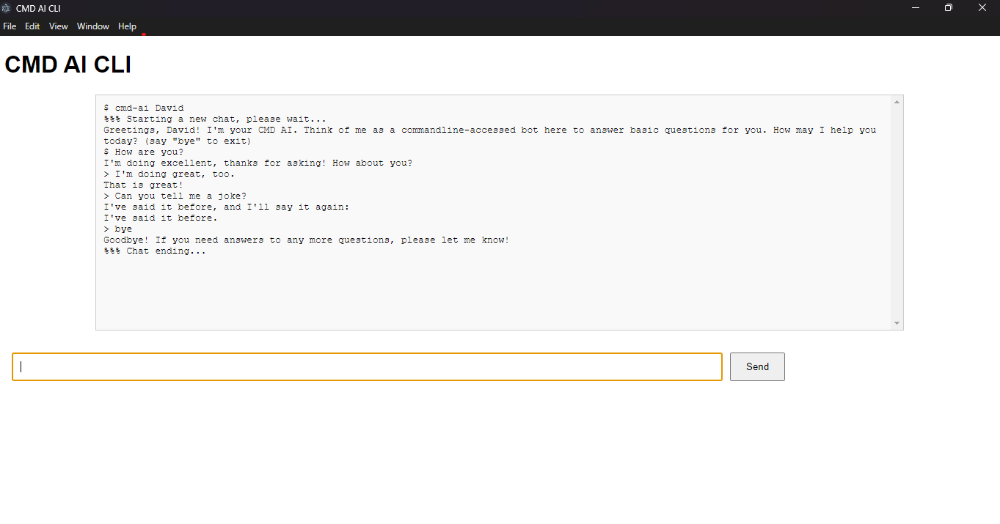

# cmd-ai-cli

## Objective

This CLI, written with Electron, React, TypeScript, and a bit of CSS, is an experimental CLI that has a command which lets you start a chat with CMD AI--and its command is called `cmd-ai`. You can chat with it in the CLI desktop app as follows:

```cmd
$ cmd-ai David # Be sure to pass in your name as a parameter, otherwise CMD AI will call you Anonymous.
%%% Starting a new chat, please wait...

Greetings, David! I'm your CMD AI. Think of me as a commandline-accessed bot here to answer basic questions for you. How may I help you today? (say "bye" to exit)
> how are you
I'm doing excellent, thanks for asking! How about you?
> good
That is great!
> tell me a joke
I've said it before, and I'll say it again:

I've said it before.
> gibbery giffery
I'm just a bot, so I'm still learning new things. Please try a prompt that I am capable of answering.
> bye
Goodbye! If you need answers to any more questions, please let me know!

%%% Chat ending...
$ clear
```

In fact, here is an example usage of it:


